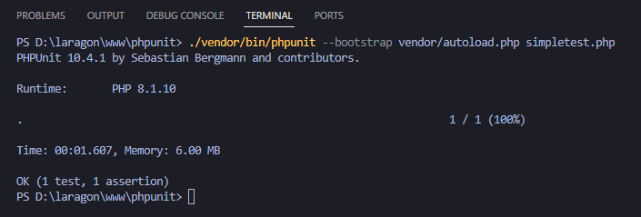
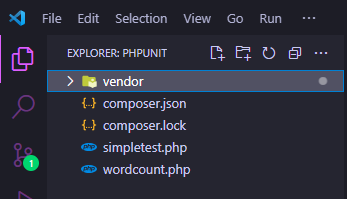

# Halo namaku Yuwandana dari prodi TIF22 BWS

Disini kita akan mencoba menghitung jumlah kata menggunakan #PHPUNIT
nah ada beberapa langkah nih untuk mencobanya:

1. Pastikan sudah menginstal composer
2. lakukan penginstalan phpunit dengan terminal lalu jalankan  

   composer require --dev phpunit/phpunit

3. Jika Instalasi sudah selesai pastikan menambah 2 file atau copy kode diatas dan taruh diluar folder vendor dan pastikan nama file sama!

   
5. lalu jalankan perintah

./vendor/bin/phpunit --bootstrap vendor/autoload.php simpletest.php

5. jika tampil test ok maka berhasil

SELAMAT MENCOBA TEMAN-TEMAN
